# Git - Building software, better together

## Training Agenda

* Introduction Git
* Version Control History, Git Design Goal
* Git Extension Installation and Setup
* Git Concept and Terminology
* Git Daily Usage
* Create your own GIT repo (local & remote)
* Git - Working dir, Stage and commit
* Git - Diff & Revert commit
* Git - Blame & File history
* Git - Branch, Merge or Rebase
* Git - Solving Conflicts
* Git - command line mode (if time permit)

> press `m` to see overview slide;
> press `g` to goto slide by number.
> <cite>Training material prepared by Eric Guo</cite>
> best view in [Google Chrome](http://www.google.com/chrome/)

## Git and Github from CNY Ticket

<iframe src="http://it.21cn.com/mi/a/2013/0123/08/20262835.shtml" width="1024" height="768" frameborder="0"></iframe>

!Github is GFW certificated

## Github and non-programming usage

* [the official Open Data Policy of the United States on GitHub](https://github.com/blog/1499-the-revolution-will-be-forked)
* [Chicago pedway/bike-routes/building-foorprints](https://github.com/Chicago)
* [German Federal Laws](https://github.com/bundestag/gesetze#german-federal-laws-and-regulations)
* [New Zealand Act Record](https://github.com/Br3nda/legislation/tree/master/act/public)

## NASA as a Github user

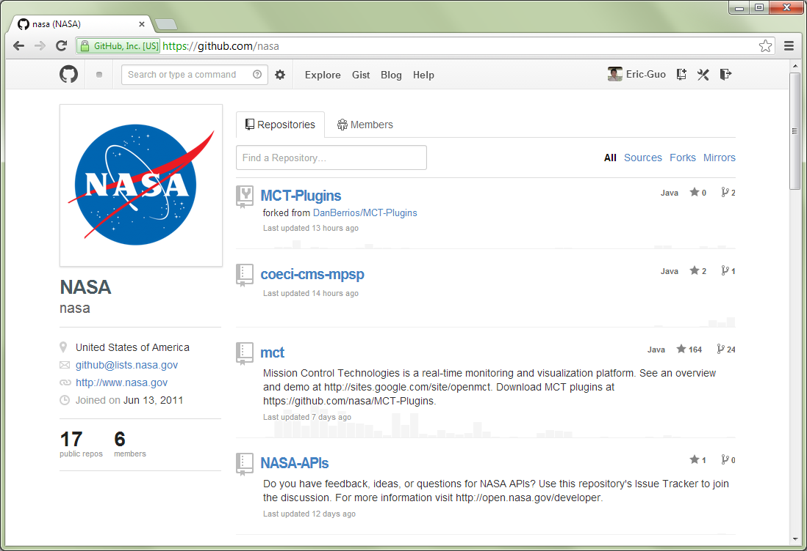

## Genetic Data on Github

<iframe src="http://manu.sporny.org/2011/public-domain-genome/" width="1024" height="768" frameborder="0"></iframe>

## Current known similar Github site

* [bit bucket](https://bitbucket.org/)
* [GitLab](https://gitlab.com/)
* [GitCafe](https://gitcafe.com/)
* [gitcd](http://gitcd.com/)
* [Gitshell](https://www.gitshell.com/)
* [Code@CSDN](http://code.csdn.net/)
* [git@oschina.net](http://git.oschina.net/)
* [repo.or.cz](http://repo.or.cz/)
* [Gitorious](http://gitorious.org/)
* [Teamhost](http://www.teamhost.org/)
* [Source Forge](http://sourceforge.net/)
* [集盒](https://geakit.com/)
* [springloops](http://www.springloops.io/)
* [Unfuddle](http://unfuddle.com/)
* [codebase](http://www.codebasehq.com/)
* [Project Hosting by Google](http://code.google.com/)
* [CodePlex by MS](http://www.codeplex.com/)
* [TaoCode by Taobao](http://code.taobao.org/)

## Version Control History

* Manually keep track of versions of code! (1960s)
* Keep lots of versions in one file! (1972, SCCS)
* You can each have your own copy checked out! (1982, RCS)
* Version multiple files at once! (1986, CVS, atomic by Subversion 2000)
* Shared repository can be on a remote machine! (1994, CVS with )
* Open source version control hosting! (1999, SourceForge)
* No central repository! (2005, GIT)
* When you checkout that’s a fork too, and you can do that in public! (2008, GIThub)

[source](http://www.flourish.org/blog/?p=397)

## Time line of the Version Control tools

I'm an egotistical bastard, and I name all my projects after myself.

First Linux, now git. -Linus Torvalds

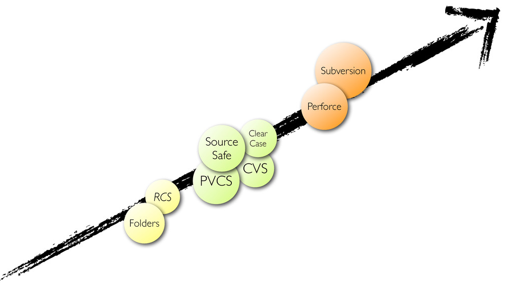

## GIT & GitHub History

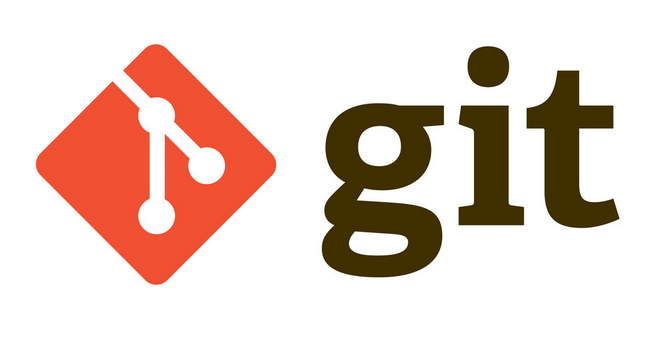

Torvalds wanted a distributed system that he could use like BitKeeper, but none of the available free systems met his needs, particularly his performance needs. From an email he wrote on 7 April 2005 while writing the first prototype.

GitHub is a web-based hosting service for software development projects that use the Git revision control system. GitHub offers both commercial plans and free accounts for open source projects. According to the Git User's Survey in 2009, GitHub is the most popular Git hosting site.

## GIT Design Goal

* Take CVS as an example of what not to do; if in doubt, make the exact opposite decision.

* Support a distributed, BitKeeper-like workflow

* Very high performanc and strong safeguards against corruption, either accidental or malicious

## GIT Extension Design Goal

* GitExtensions is a shell extension, a Visual Studio 2008 / 2010 plug-in and a standalone GIT repository tool.

* Great tools enable you think and work in Unix style gradually

## GIT Extension Install - All User

[http://code.google.com/p/gitextensions/](http://code.google.com/p/gitextensions/) (download URL)

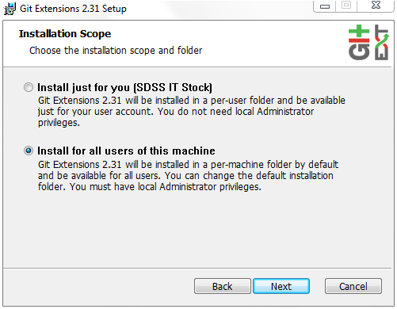

## GIT Extension Install - Both

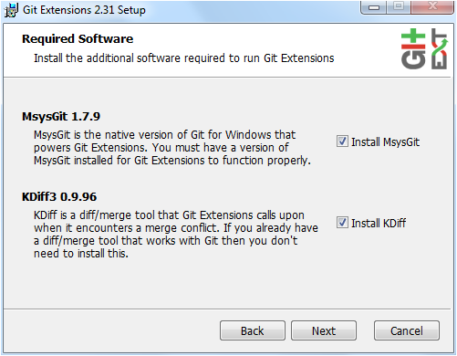

## GIT Extension Install - Integration

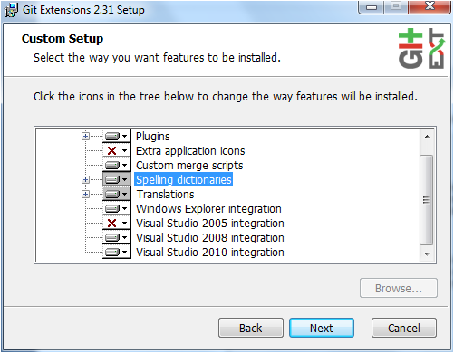

## GIT Extension Install - PuTTY

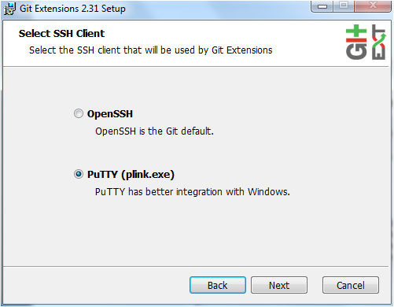

## GIT Extension Install - KDiff3

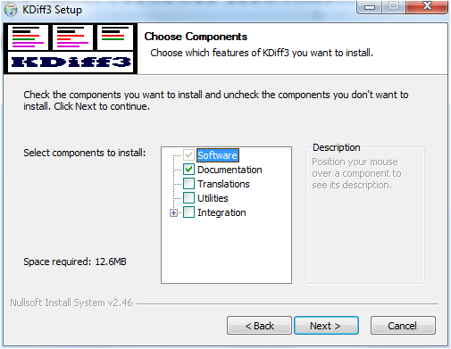

## GIT Extension Install - MsysGIT

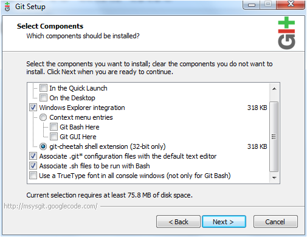

## GIT Extension Install - Bash Only

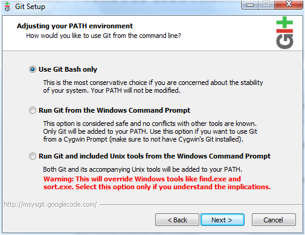

## GIT Extension Install - cross-platform

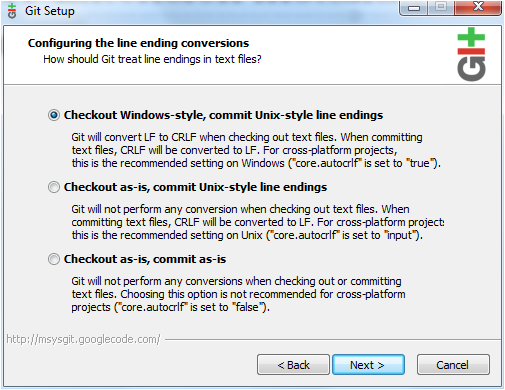

## GIT Extension Setup

GIT Extension -> Settings -> Settings to fill:

    * User Name
    * eMail

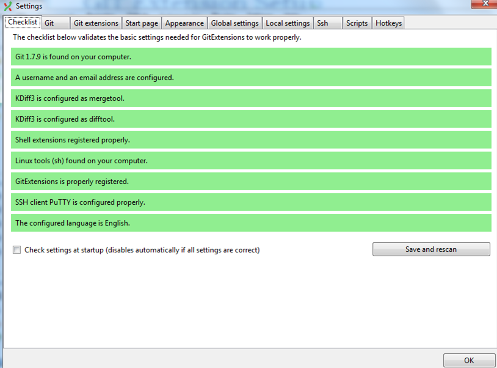

## GIT Generate SSH Key

GIT Extension -> Remotes -> PuTTY -> Generate or import key:

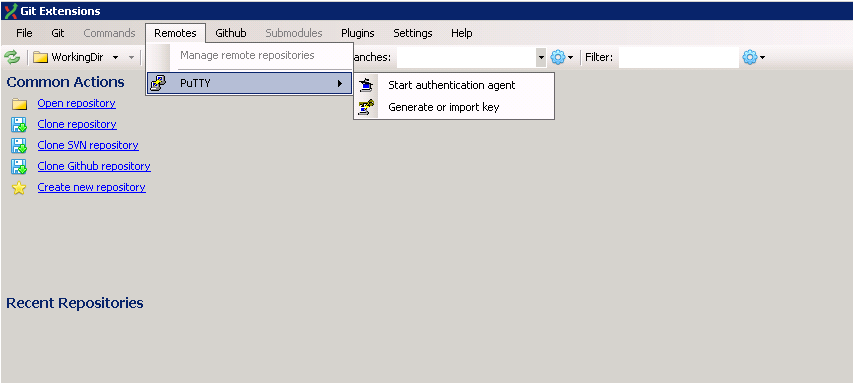

## GIT Email your Public key to Admin

1. Copy selection text and email to your Admin
2. Save private key because you need private key to login latter
3. Loss private key need regenerate private key and resent public key to Admin

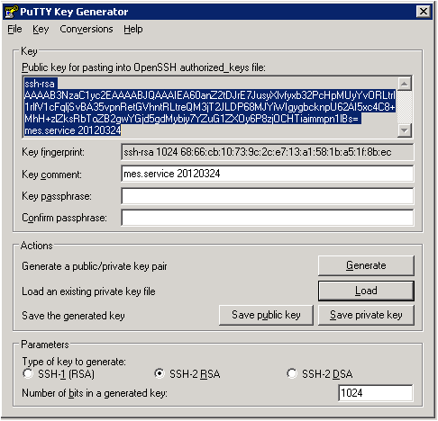

## GIT clone your first repositories

Repository to clone: *gitolite@cvpscmip01:testing.git*

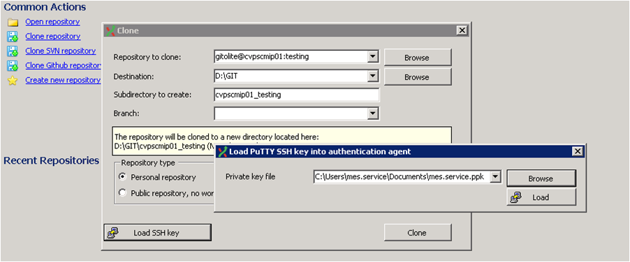

## GIT Commit/Push your first change

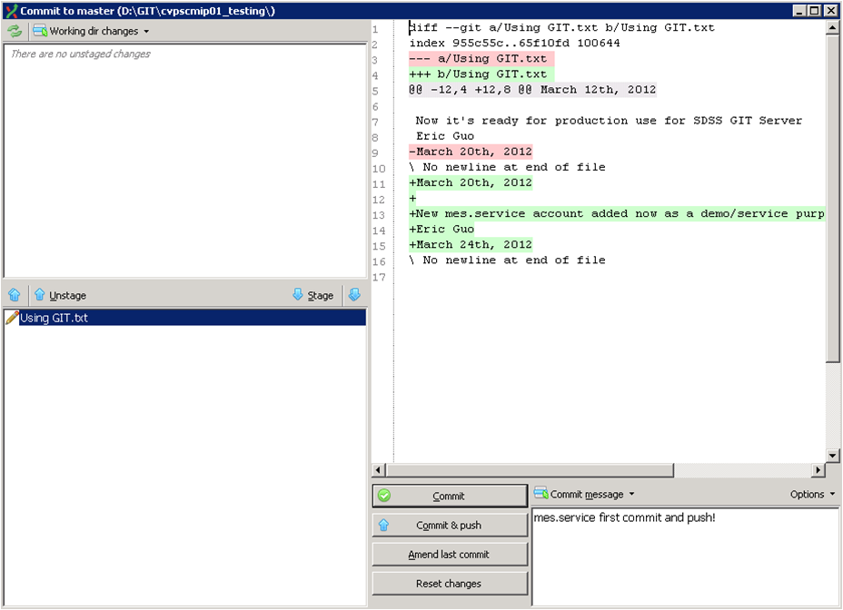

## GIT Daily Usage in SVN way

* Clone (SVN Checkout)
* Commit (in Local)
* Push (SVN Commit)
* Pull (SVN Update All)
* gitK (SVN History)

## GIT Concept and Terminology

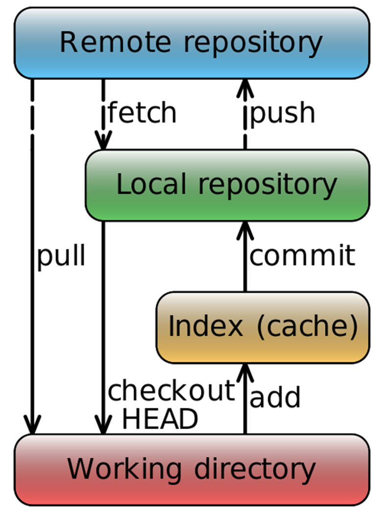

## gitk - a GUI commit viewer for git

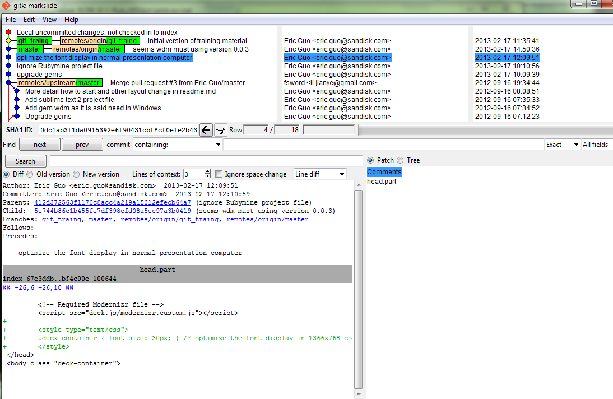

## GIT Key Sales Point

1. Very fast and user friendly
1. Source Code Repository is distributed, isolated, history complete
1. All action can run in Local except pull and push
1. Submit and rollback always success (until pull and push)
1. Can fix last submit very easily

## Create your GIT repository in GIT Extension

Open Repopsitory -> Your not GIT init yet folder -> Initialize Repository

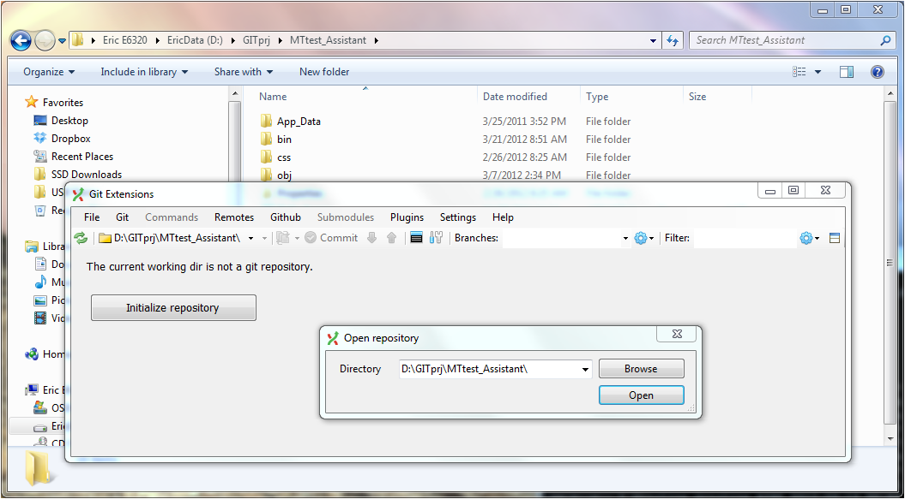

## Add .gitignore for VS.NET intermediate files

Forgot any add ignore file and pattern in Subversion, now it’s a One-click only action!

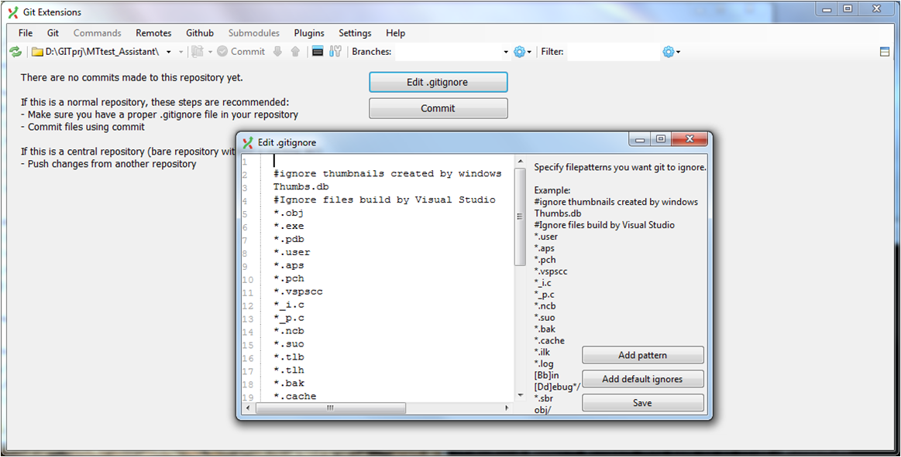

# Don’t forgot to add ignore files!

## Add .gitignore to ignore VS.NET *intermediate* files

#### The obj/exe or any other binary file will make repository looks like amature job!

## Commit initial version of files

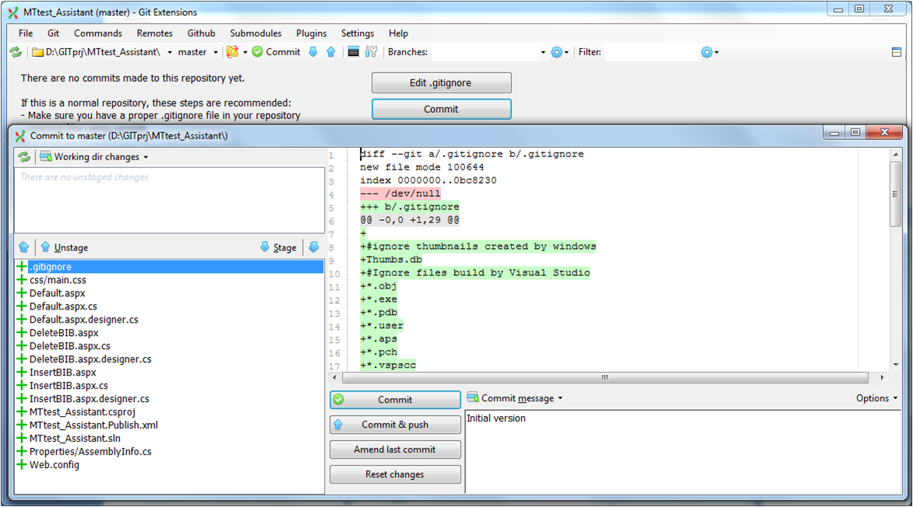

## Push your repository to CVPSCMIP01

You can to put any repository to:  (no need inform GIT admin!)

    gitolite@cvpscmip01:/usr/[*yourname*]/[*your_repository_name*]

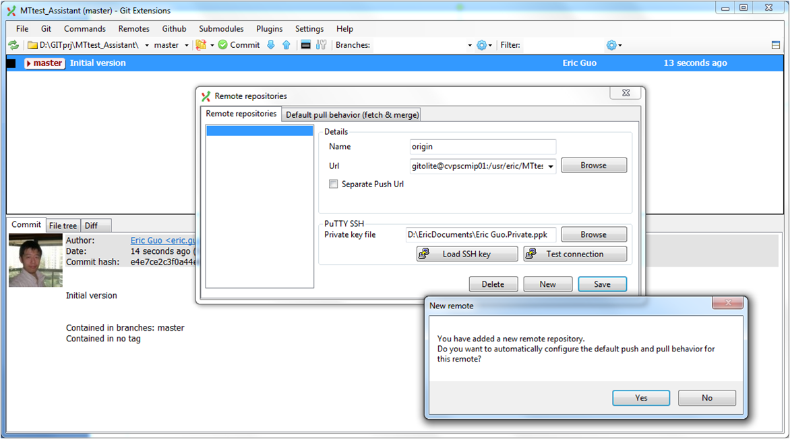

## Your repository is visible at Web!

1. Work as own at first in your usr folder. (No need to inform GIT Admin)
2. Rise your project to root folder if it is company widely used and relatively stable. (Need GIT Admin help)
3. Old Subversion project will moved to root folder by GIT Admin already

#### [http://cvpscmip01/usr/eric/MTtest-Assistant.git](http://cvpscmip01/usr/eric/MTtest-Assistant.git)

## More Git tricks need console now

Setting description for your own repository:

    6749@SHE127731 /c/git
    $ echo "A semi-auto MES Yield Limit Batch setting tools used in SPAS 125-001" | ssh gitolite@cvpscmip01 setdesc usr/eric/YieldLimits-Change
    Enter passphrase for key '/c/Users/6749/.ssh/id_rsa':

New description is: *A semi-auto MES Yield Limit Batch setting tools used in SPAS 125-001* now

## Working dir, Stage and commit

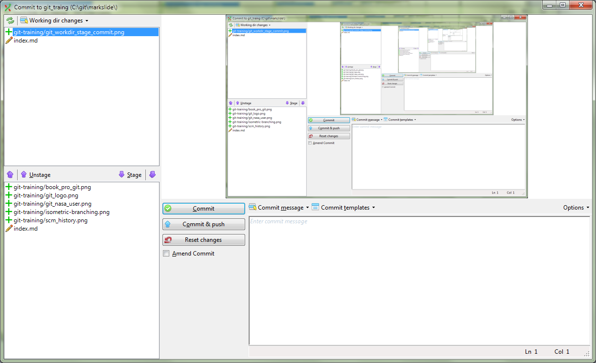

## Diff, Revert or Cherry Pick commit

Diff is the acturally change in each commit, you can revert the commit and cherry pick commit to other branch if require.

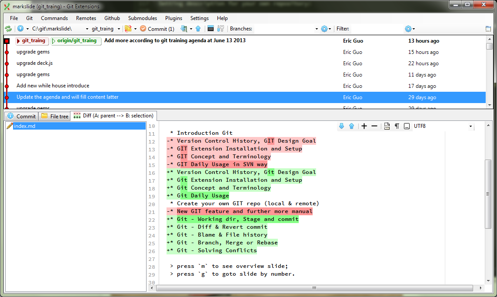

## Git Blame and File history

Blame is used to check who is response to file change, File history is to check single file change.

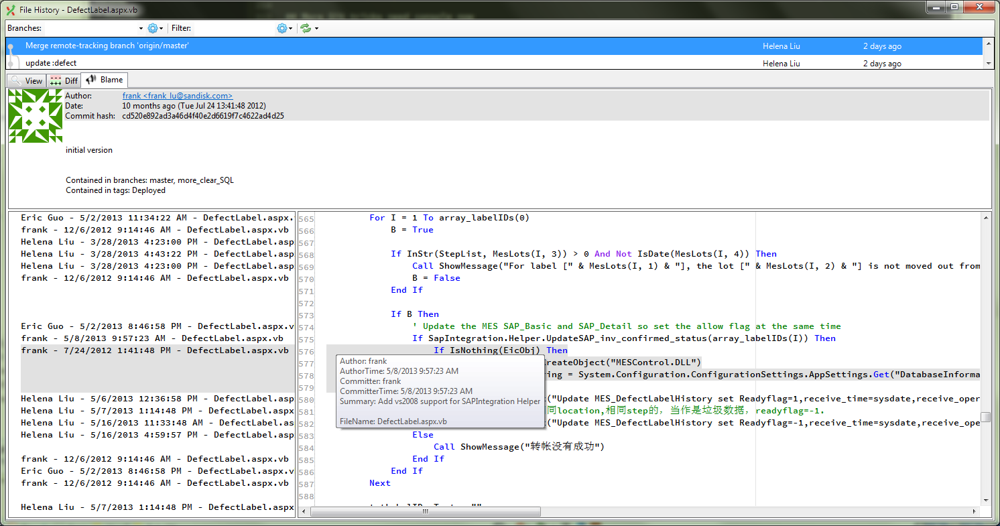

## Git Branch

Branching in Git is a function that is used to launch a separate, similar copy of the present
workspace for different usage requirements. In other words branching means diverging from
whatever you have been doing to a new lane where you can continue working on something
else without disturbing your main line of work.

## Merge or Rebase

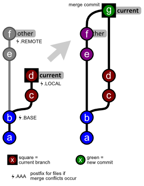
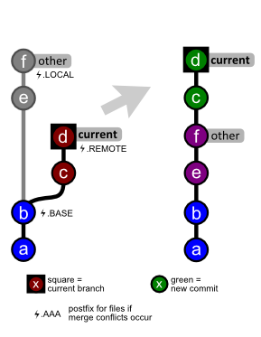

Rebase is more clear.

Merge show the fact "parallel evolutions of a same source code base"

After a rebase, [it's impossible to determine what was originally part of the commits and what was introduced as a result of bad conflict resolution](http://stackoverflow.com/questions/457927/git-workflow-and-rebase-vs-merge-questions).

## Solving Conflicts

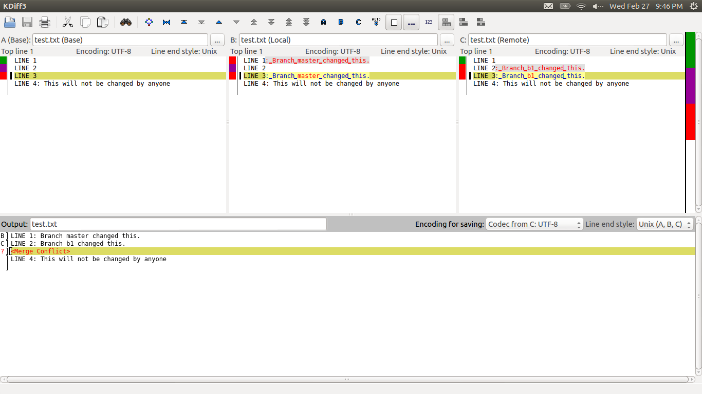

[source](http://tedfelix.com/software/git-conflict-resolution.html)

## Live Demo 1 - Learning from code history

[Mes View](http://mesview.sandisk.com/orders/000005071229)

* [Skip to display shipping date if shipping date is empty](http://cvpscmip01/mv.git/commitdiff/67e082867b206f39ae55cce35b96215d08cdef46?hp=4ff1067643645a853b6fc57c3a0ead8cb5d766e5)
* [using the @media print to hide the navbar to get better result both in HTML page or print](http://cvpscmip01/mv.git/commitdiff/0c42a0ece84f26010006e0c38617be56e5cdc6e3?hp=68f1ba349e7428e8bf14ef49d7a5a0c8b9bcb645)
* [Fix barcode, still using png file instead of html table, since the png will more print friendly.](http://cvpscmip01/mv.git/commitdiff/1972e825c1870412215558a681b8c55b5a5a3acb?hp=aeff7dacb5b99c4a5ba28099ade8f425080852e5)

## Live Demo 2 - Sync with open source project

[http://overapi.sandisk.com/](http://overapi.sandisk.com/)

* how to pull from official site
* how to apply to rebase ad remove
* how to solve conflicts
* how to build and deploy new site to SDSS

## Live Demo 3 - Browsing a SDSS real project.

[Classic WIP](http://cvpscmip01/classic-wip45.git)

* Impact history
* Commit Statistics
* Why commit statistics number can not be a KPI
* Why code of line number can not be a KPI

## Some tips when you working with multi user Git repository

* master should always deployable and focus on production
* write your purpose in commit message, give relative information if need
* push faster than your colledge
* [Fight with Software Complexity](http://blog.pdark.de/2012/07/14/software-development-costs/)

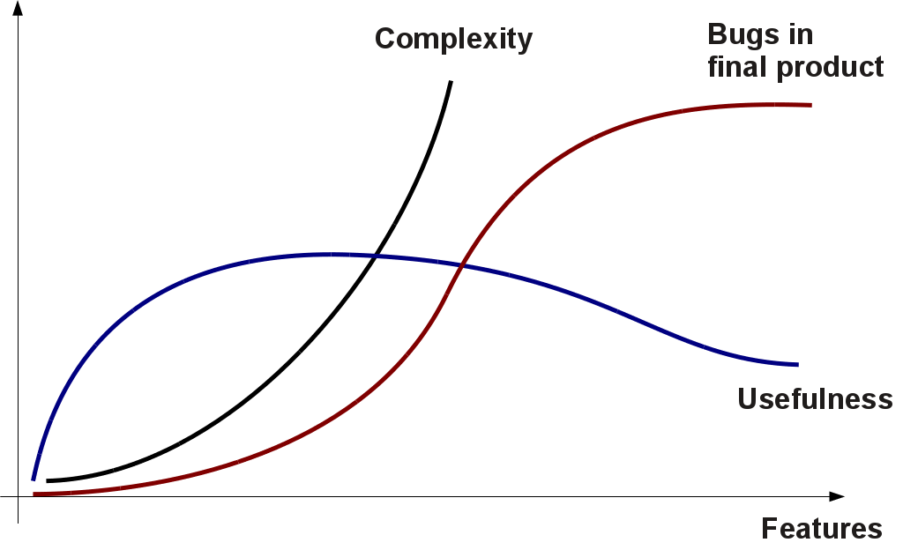

## A successful Git branching model

[source](http://nvie.com/posts/a-successful-git-branching-model/)

## More document and essay about GIT

* Git Extensions User Manual (in your hard drive after install GIT Extension)
* [Pro GIT](http://progit.org/book/) ([中文](http://progit.org/book/zh/))
* [GIT Magic](http://www-cs-students.stanford.edu/~blynn/gitmagic/) ([中文](http://www-cs-students.stanford.edu/~blynn/gitmagic/intl/zh_cn/))
* [Git Tips集锦](https://gitcafe.com/riku/GitTips)
* [Git权威指南](http://www.worldhello.net/gotgit/)

Things we not mentioned:

    GIT command line mode

## Git command line bonus tips

* git clone --single-branch <repo.url>
* git clone --depth <number> <repo.url>
* git rebase -i master~2

<blockquote cite="http://www.arthurcclarke.net/">
  
The difference between machines and human beings is that human beings can be reproduced by unskilled labor.

  
<cite>Arthur C.Clarke</cite>

</blockquote>

# Question & Answer ?